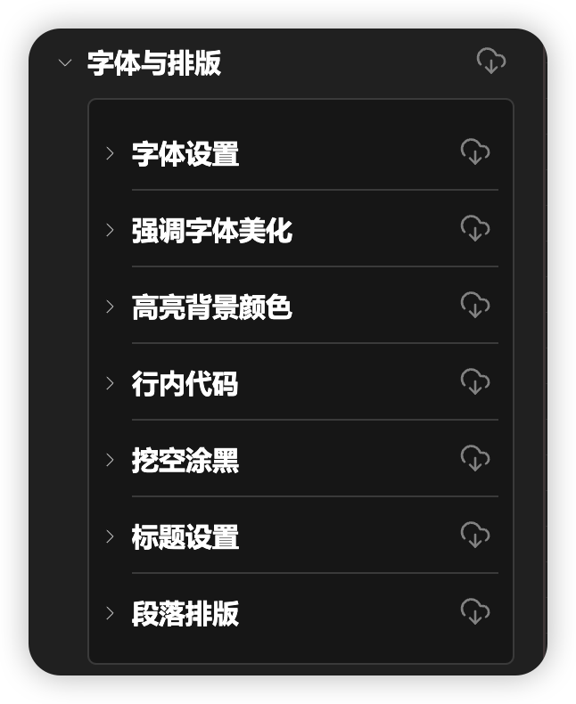
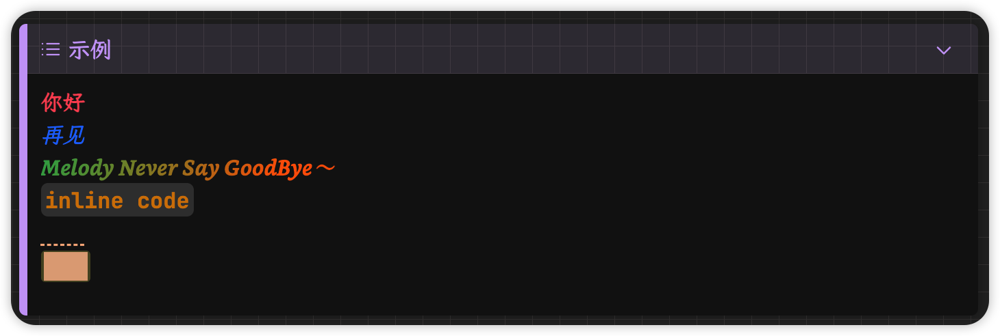
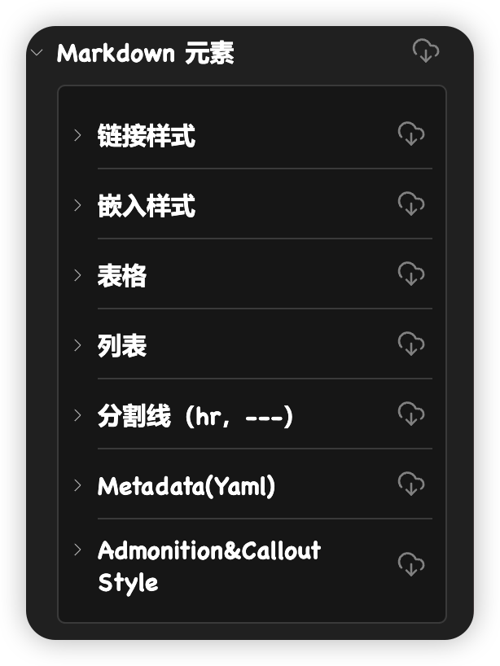
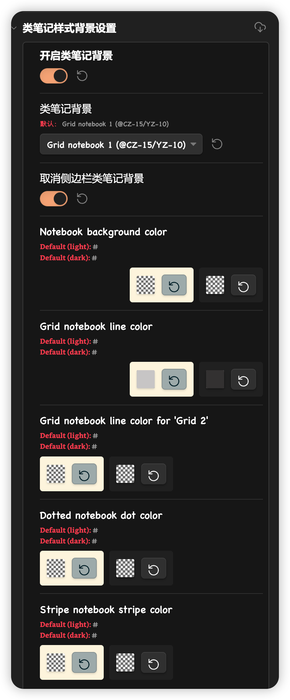
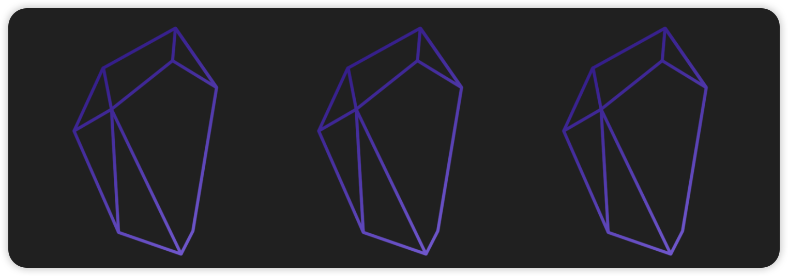
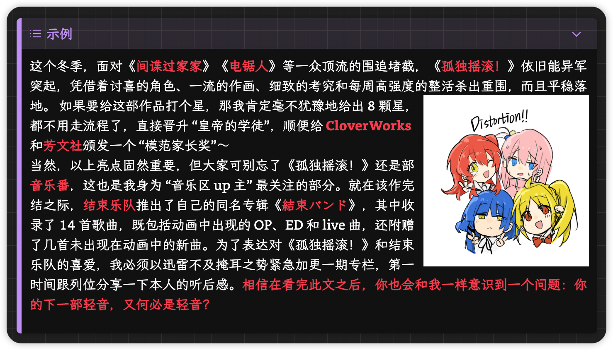
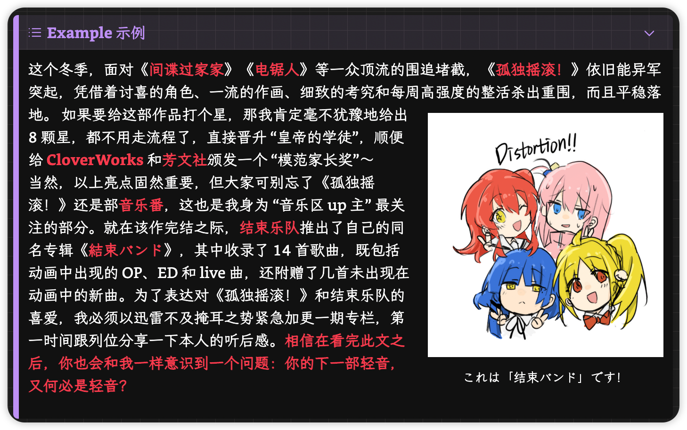

> [!note]
> A css snippet used to bring useful features in the BT theme to Obsidian non-Blue Topaz theme users.
>
> **原作者主题见**：https://github.com/PKM-er/Blue-Topaz_Obsidian-css

# 浓缩精华——Blue Topaz Legacy
## 制作初衷

*Blue Topaz* 主题是一个非常优秀的主题，由 3 f 等多位大佬一起开发而来，内含许多种自定义方案以及强大的扩展功能。但是除去这些最为明显的优势，该主题在==「**基础优化**」==方面的优秀也是不可忽视的。例如在许多从其他平台迁移而来的用户看来理所当然的「首行缩进」、「两端对齐」功能，图片自适应显示强调字体的颜色、挖空涂黑等等新的字体强调方式，以及一些 admonition 小组件的 css 处理。这些功能不仅默认主题中没有，大部分主题（如 *AnuPpuccin*等）也都缺失这些功能, 或者在相应功能上不如 bt 完善。为了在其他主题中也可以使用这些基础优化，达到舒适的编辑体验，我将 *Blue Topaz*主题中包含重要基础优化的片段摘录出来，重新整合成了「**Blue Topaz Legacy**」css 片段，供大家使用。

除此之外，本片段也集合了少数非 bt 主题，但我个人认为好用的小功能。各功能是否启用，大家可以通过 Style Settings 插件设置自行把握。

下面简要介绍一下截止版本 v 1.4，Blue Topaz Legacy 包含的功能。

> [!attention]+ 本片段的 AnuPpuccin 适配性
> 由于本人主力使用 AnuPpuccin 主题，因此对于片段和主题的一些不兼容之处，本人是以 AnuPpuccin 主题的视角进行适配修改的。
> 如果您使用的不是 AnuPpuccin 主题，可能会出现一些适配上的错误。但是您可以通过修改本人在 CSS 代码中注释提到「AnuPpuccin」的地方，使片段调整适配您的主题。

## Typography：字体与排版

### 字体与排版设置

具体包括：

- **强调字体**和**库名字体**自定义
- 强调**字体颜色自定义**，加粗斜体的字体颜色是*线性渐变色*，强调字体优先级为：粗体>斜体>内链
- 增加**高亮背景颜色**、高亮文字颜色的简单设置，并提供是否开启 Blue Topaz 风格高亮的选项
- 增加**行内代码**样式设置
- 增加**挖空涂黑样式**设置，以及可以设置涂黑样式是否开启**圆角**
- 增加**标题设置**，可以对不同层级的标题的**段前距**、**段后距**以及**缩进程度**进行调整
- 增加**段落排版**功能，支持设置**首行缩进**、**两端对齐**等功能

> [!attention]+ 注意
> 若要在阅读模式使用段落首行缩进与两端对齐样式，需要下载安装 *Contextual Typography* 插件。

## Markdown 元素

### 链接美化

具体包括：

- **内链**：
    - 可以设置是否开启**下划线**
    - 可以设置内链下划线是否为**波浪线**，且可以在 style settings 中全局开启或使用 `hide-wavy` cssclass 制作白名单，在单一笔记中不开启
    - 可以设置**内链文字颜色**
- **外链**：
    - 可以设置是否开启**下划线**
- 可以设置**未创建链接**的颜色
- 可以设置悬浮鼠标时**链接背景**为彩虹色
- 取消编辑模式下点击链接**自动跳转**，按住 `command` 按钮跳转

### 嵌入&悬浮弹窗美化

具体包括：

- 可以调整**嵌入页面的高度**
- 可以设置**嵌入背景透明**
- 可以**隐藏**嵌入文档的笔记名称、H1 H2 H3 标题
- 可以**隐藏**嵌入文档的 banner
- 嵌入文档支持**浮动效果**
- 支持设置**悬浮弹窗的背景颜色**

### 表格美化

具体包括：

- 表格**悬浮放大**效果
- 当文字过多，一行放不下的时候有**四种显示格式**
- 可以选择是否**显示表格框线**
- 可以设置表格是否**全宽**
- 有四种**显示样式**可供选择

另外，还有 Blue Topaz 主题以外的新增样式：

- 三线表（Three-Line-Table）表格样式，包括在主题中选择样式和在 metadata 的 cssclass 中声明 `three-line-table` 两种激活方式。

### 列表

具体包括：

- 设置**列表间距**
- 设置**无序列表的样式**：形状、间距、颜色等
- 设置**有序列表的样式**：序号形式、间距、颜色等
- **彩虹列表序号和任务选择框**
- **彩虹大纲线**

### 分割线

可以选择分割线的样式，具体包括：

- Default
- with icons
- without icons
- with Numbers

### Metadata 样式

可以设置在阅读模式下仅显示 metadata 中的 `alias` 和 `tag` 字段。

## 页面设置
### 左侧边栏样式选择
- `fixed`：默认设置，左侧边栏保持显示
- `Hide to left`：不使用时将左侧边栏简单粗暴地缩起
- `Hide to the left retention drawer`：相比上一选项更加丝滑，但可能需要针对主题单独适配。

### 类笔记样式背景设置

具体包括：

- 可以**开启网格背景**
- 可以选择**是否为嵌入的笔记同样设置网格背景**
- 可以设置**边栏的笔记不应用**网格背景
- 可以设置几种**不同的网格**
- 可以设置**网线、背景板的颜色**

### 侧面拆分面板中的 md 文件

可以设置侧面拆分面板中 md 文件的

- 字体大小
- 行间距
- 或切换回与中间面板中 md 一致的「默认模式」」

### 加载页面
- 可以在 Obsidian 显示加载动画时将默认加载动画替换为自定义文字
- 自定义文字可以辅以不同的动态效果显示

## 插件
### Admonition 特别样式支持

完全适配了 Blue Topaz 内置的所有 ad 类型，包括：

目前支持 ad 类型：

- blank **全透明框**
- def definition
- thm theorem
- lem lemma
- cor corollary
- pro proposition
- hibox **自动隐藏框**
- col 2 col 3 col 4 **内容分多栏**
- kanban **伪看板**
- table **表格单行全部显示**

关于 Callout 的部分可以见 [[README#Callout 增强|Callout增强]]

### buttons

### Hover Editor

- 增加了控制 hover editor 是否显示 metadata 属性面板的选项。

## 未出现在 Style Settings 中的效果

### 图片自适应显示

在 Obsidian 笔记中的图片可以**自适应页面宽度**，以最合适的大小显示。

### 图片排版优化

具体包括：

- **图片自适应显示**：`--image-max-width: 100%`
- **图片自适应横排**：`img-grid`
- **图例说明**：`img-captions`*（只适用于 Wiki 链接格式）*
- 图片向**左、右对齐与居中**
- 图片与文字**在行中混排（向左、右对齐与居中）**
- 图片**大小设置**

下面只是大致介绍，图片排版优化的具体详细使用方法，可以参考 Blue Topaz 示例库在这方面的说明。

#### 图片自适应横排
- 方法一：图片加 `|inline`，放在同一行。可以单独调整大小
- 方法二：图片加 `|+grid`，放在同一行，会自动调整大小，也可以独单调整
  `![[xxx.png|+grid]]`
- 方法三：在笔记 YAML 处输入 `cssclass: img-grid`

#### 图片大小与位置
- 插入的图片默认是居中显示，点击图片可以放大
- 在图片后加上 `|数字` 可以控制图片大小
- 在图片后加上 `|R` 或 `|L`，可以控制图片居右还是居左，也可以跟上面的控制大小同时使用。
- 另外，以下形式也可以使用。同一行的四种输入方式，效果都是一样的

`left` / `Left` / `LEFT` / `L`

`right` / `Right` / `RIGHT` / `R`

- 在图片后加上 `|inlR`、`|inlL` 或 `|inl`，可以使图片变为行内显示，也可以跟控制大小同时使用。`![[image-20230204021300718.png|inl|100]]` 可用变体有：

`inlineL` / `InlineL` / `INLINEL` / `inlL`

`inlineR` / `InlineR` / `INLINER` / `inlR`

`inline` / `Inline` / `INLINE` / `inl`

> [!tip]+ Tips
> 注意使用 `inlR/inlL` 和 `inl` 的位置，对于 `inlR` 和 `inlL`，它们所在行的文字，处在图片的上边界处。而对于 inl，所在行的文字在图片的下边界处。

使用效果：

#### 图例效果
- 在图片后加 `#centre` / `center`、`#right` 或 `#left`

形如：`![[xxx.png#position|captions|size]]`

- 行内或连续的图例，使用 `#inl`

### Callout 增强

个人主要在 *Anuppuccin* 主题中增强适配了三个 callout 类型：

- callout *icon*：实现首页日历图标
- callout metadata *no-border*：实现首页隐藏边框，天气问候
- callout metadata *banner*：实现首页隐藏边框，天气问候

一些增强适配，防止片段的样式与主题或其他片段冲突：
- 与 AnuPpuccin 的 sleek 样式 callout 完美兼容
- 支持 PLN 主题的 callout 片段，不会发生冲突

## 目前已知问题⚠️

- 尽量不要使用带有==「**全宽显示**」==的 style settings，因为开启会导致 Obsidian「外观」设置中的「**缩减栏宽**」设置失效。
- 「[[#加载页面]]」文字功能，只有当其他三种效果同时打开时，移动效果才不会生效。
